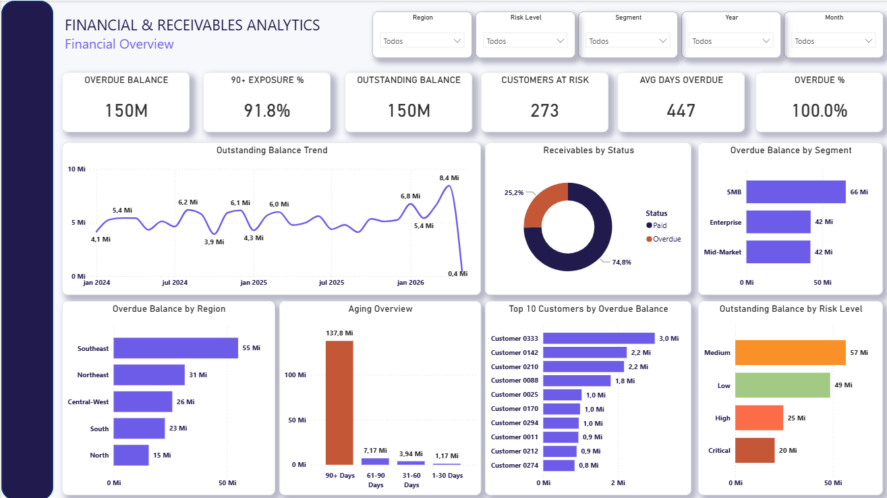
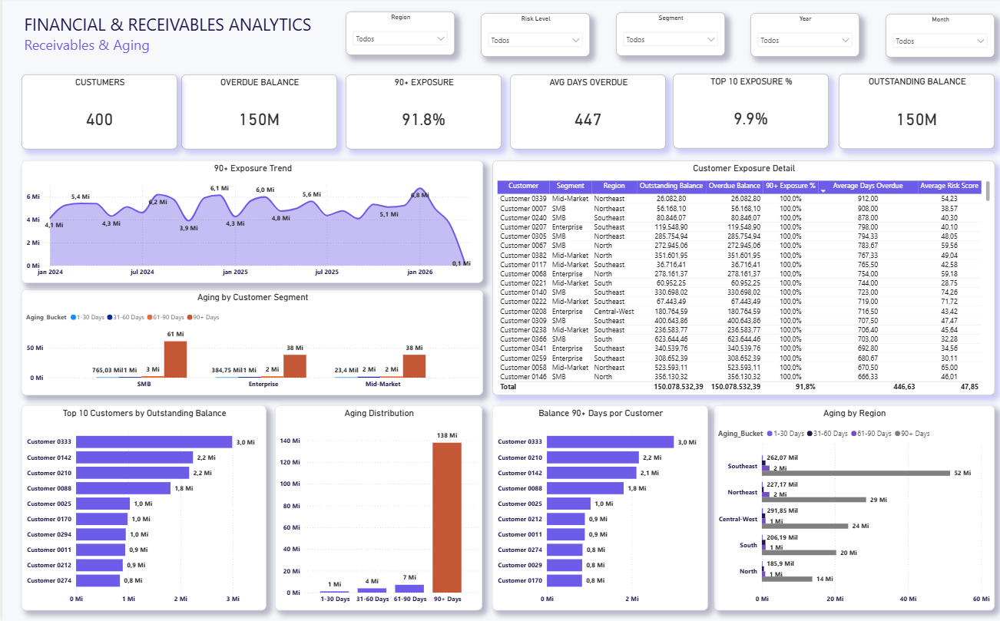
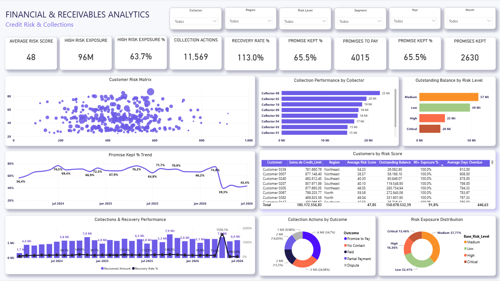

# 💰 Financial & Receivables Analytics

> Power BI project focused on accounts receivable performance, aging analysis, credit risk, and collection effectiveness.

---

## 📌 Project Overview

This project was developed to demonstrate how Business Intelligence can support financial decision-making by transforming accounts receivable data into actionable insights.

The dashboard provides an executive and analytical view of the receivables portfolio, allowing users to monitor overdue exposure, aging concentration, customer credit risk, and collection performance.

The project was built using a simulated dataset created specifically for portfolio purposes.

---

## 🎯 Business Problem

Finance and collection teams need to quickly understand:

- How much of the receivables portfolio is overdue?
- Where is overdue exposure concentrated?
- Which customers represent the highest financial risk?
- How severe is the aging profile?
- How effective are collection actions?
- Are payment promises being fulfilled?
- Which customers should receive collection priority?

The dashboard was designed to answer these questions and support data-driven collection and credit decisions.

---

## 🛠️ Tools & Technologies

- Power BI
- DAX
- Power Query
- Data Modeling
- Financial Analytics
- Data Visualization

---

## 📊 Dashboard Structure

The solution is divided into three analytical pages:

### 1️⃣ Financial Overview

Provides an executive view of the receivables portfolio, including outstanding balance, overdue exposure, customer risk, aging profile, and portfolio distribution.



---

### 2️⃣ Receivables & Aging

Explores where overdue exposure is concentrated and how severe the aging profile is across customers, segments, and regions.

Key analyses include:

- 90+ day exposure
- Aging distribution
- Customer exposure
- Aging by customer segment
- Aging by region
- Customers with the highest outstanding balances



---

### 3️⃣ Credit Risk & Collections

Evaluates customer credit risk and the effectiveness of collection activities.

The page includes:

- Customer Risk Matrix
- High-risk exposure
- Collection performance by collector
- Recovery rate
- Promise-to-pay performance
- Collection outcomes
- Risk exposure distribution



---

## 📈 Key KPIs

The dashboard monitors key financial and collection indicators, including:

- Outstanding Balance
- Overdue Balance
- Overdue %
- 90+ Days Exposure
- Average Days Overdue
- Customers at Risk
- Average Risk Score
- High Risk Exposure
- Collection Actions
- Recovery Rate %
- Promise Kept %
- Top Customer Exposure

---

## 🔍 Key Insights

The analysis highlights several relevant portfolio patterns:

- A significant portion of overdue exposure is concentrated in the **90+ days aging bucket**, indicating elevated collection risk.
- A relatively small group of customers represents a meaningful share of total outstanding exposure.
- Customer risk varies significantly across the portfolio, allowing high-risk accounts to be prioritized.
- Aging analysis by region and customer segment helps identify areas with greater overdue concentration.
- Payment promise performance can be monitored over time to identify deterioration in collection effectiveness.
- Combining credit risk, aging, and outstanding balance provides a stronger basis for collection prioritization than analyzing each indicator independently.

---

## 🧠 Analytical Approach

The project was designed around three levels of analysis:

**Executive Monitoring**  
Overall financial health and receivables performance.

**Exposure Analysis**  
Identification of aging concentration and customers responsible for the largest outstanding balances.

**Risk & Collection Management**  
Evaluation of customer credit risk and collection effectiveness to support prioritization.

---

## 🗂️ Repository Structure

```text
financial-receivables-analytics/
│
├── README.md
│
└── screenshots/
    ├── financial-overview.png
    ├── receivables-aging.png
    └── credit-risk-collections.png

---

## 👩‍💻 About the Author

**Caroline Stange**

Data & BI Analyst focused on transforming complex business data into actionable insights and decision-support solutions.

**Core Skills:** Power BI • SQL • Python • DAX • Data Modeling • Business Intelligence • Data Analysis

---

⭐ This project is part of my Data Analytics & Business Intelligence portfolio.

