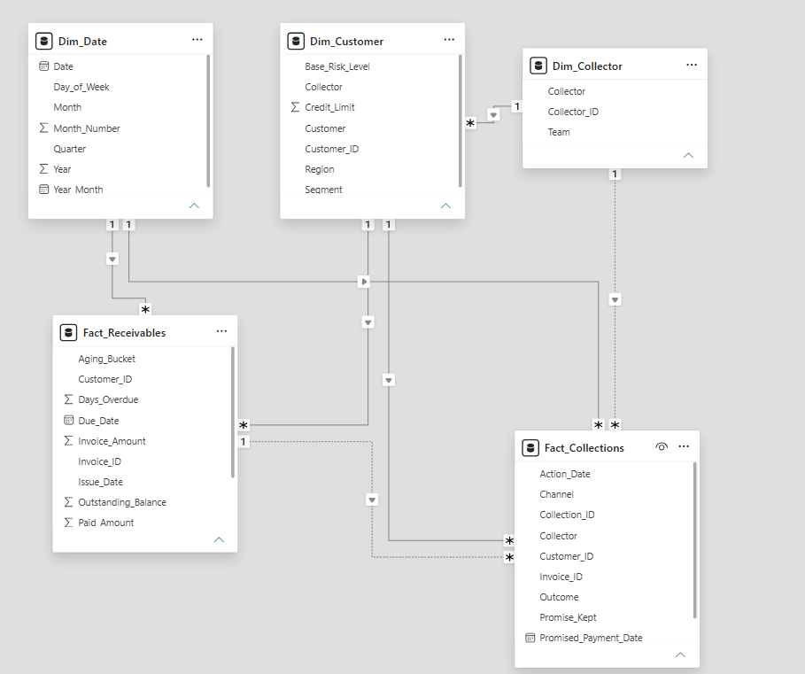

# 💰 Financial & Receivables Analytics

> Power BI project focused on accounts receivable performance, aging analysis, credit risk, and collection effectiveness.

---

## 📌 Project Overview

This project was developed to demonstrate how Business Intelligence can support financial decision-making by transforming accounts receivable data into actionable insights.

The dashboard provides executive and analytical views of the receivables portfolio, allowing users to monitor overdue exposure, aging concentration, customer credit risk, and collection performance.

The project was built using a **simulated dataset created specifically for portfolio purposes**.

---

## 🎯 Business Problem

Finance and collection teams need to quickly understand:

- How much of the receivables portfolio is overdue?
- Where is overdue exposure concentrated?
- Which customers represent the highest financial risk?
- How severe is the aging profile?
- How effective are collection actions?
- Are payment promises being fulfilled?
- Which customers should receive collection priority?

The dashboard was designed to answer these questions and support data-driven credit and collection decisions.

---

## 🛠️ Tools & Technologies

- Power BI
- DAX
- Power Query
- Data Modeling
- Financial Analytics
- Data Visualization

---

# 📊 Dashboard

The solution is divided into three analytical pages.

## 1️⃣ Financial Overview

Provides an executive view of the receivables portfolio, including outstanding balance, overdue exposure, customer risk, aging profile, and portfolio distribution.

### Main analyses

- Outstanding Balance
- Overdue Balance
- Overdue %
- Customers at Risk
- Average Days Overdue
- Aging Overview
- Overdue Balance by Segment
- Overdue Balance by Region
- Outstanding Balance by Risk Level
- Top Customers by Overdue Balance


---

## 2️⃣ Receivables & Aging

Explores where overdue exposure is concentrated and how severe the aging profile is across customers, segments, and regions.

### Main analyses

- 90+ Days Exposure
- Aging Distribution
- Customer Exposure Detail
- Aging by Customer Segment
- Aging by Region
- Customers with the Highest Outstanding Balance
- Customers with the Highest 90+ Days Exposure


---

## 3️⃣ Credit Risk & Collections

Evaluates customer credit risk and the effectiveness of collection activities.

### Main analyses

- Customer Risk Matrix
- High Risk Exposure
- Collection Performance by Collector
- Recovery Rate
- Promise-to-Pay Performance
- Collection Outcomes
- Risk Exposure Distribution
- Collection & Recovery Performance


---

# 📈 Key KPIs

The dashboard monitors key financial and collection indicators, including:

| KPI | Purpose |
|---|---|
| **Outstanding Balance** | Measures the total open receivables portfolio |
| **Overdue Balance** | Measures the value currently past due |
| **Overdue %** | Shows the proportion of outstanding receivables that are overdue |
| **90+ Days Exposure** | Identifies severely overdue receivables |
| **90+ Exposure %** | Measures the concentration of outstanding balance in the 90+ days bucket |
| **Average Days Overdue** | Indicates the average delinquency severity |
| **Customers at Risk** | Identifies customers presenting relevant credit exposure |
| **Average Risk Score** | Measures the overall customer credit risk profile |
| **High Risk Exposure** | Quantifies outstanding balance associated with higher-risk customers |
| **Collection Actions** | Measures collection activity volume |
| **Recovery Rate %** | Evaluates collection recovery performance |
| **Promise Kept %** | Measures fulfillment of payment promises |

---

# 🔍 Key Insights

The analysis highlights several relevant portfolio patterns:

- A significant portion of overdue exposure is concentrated in the **90+ days aging bucket**, indicating elevated collection risk.

- A relatively small group of customers represents a meaningful share of total outstanding exposure.

- Customer risk varies significantly across the portfolio, allowing high-risk accounts to be prioritized for collection actions.

- Aging analysis by region and customer segment helps identify areas with greater overdue concentration.

- Payment promise performance can be monitored over time to identify deterioration in collection effectiveness.

- Combining **credit risk, aging severity, and outstanding balance** provides a stronger basis for collection prioritization than analyzing each indicator independently.

---

# 🧠 Analytical Approach

The project was structured around three levels of analysis:

### Executive Monitoring

Provides a high-level view of the financial health of the receivables portfolio and its main performance indicators.

### Exposure Analysis

Identifies aging concentration, regional and segment patterns, and customers responsible for the largest outstanding balances.

### Risk & Collection Management

Combines customer risk indicators with collection performance to support prioritization and decision-making.

---

# 🗂️ Data Model

The Power BI model was structured using a **fact-and-dimension approach**, separating transactional data from descriptive business dimensions.

### Fact Tables

**Fact_Receivables**

Contains invoice-level financial information, including:

- Invoice Amount
- Outstanding Balance
- Paid Amount
- Due Date
- Payment Date
- Days Overdue
- Aging Bucket
- Risk Score

**Fact_Collections**

Contains collection activity information, including:

- Collection Actions
- Collection Channel
- Collection Outcome
- Payment Promises
- Promise Status
- Recovered Amount

### Dimension Tables

**Dim_Customer**

Contains customer attributes such as:

- Customer
- Segment
- Region
- Base Risk Level
- Credit Limit
- Assigned Collector

**Dim_Date**

Provides the calendar structure used for time intelligence and trend analysis.

**Dim_Collector**

Contains collector and collection team information.

### Model Diagram



---

# 🧮 DAX Measures

Business logic was implemented using DAX measures to keep calculations centralized and responsive to report filters.

Examples of key measures used throughout the dashboard include:

```DAX
Outstanding Balance =
SUM(Fact_Receivables[Outstanding_Balance])
```

```DAX
Overdue Balance =
CALCULATE(
    [Outstanding Balance],
    Fact_Receivables[Status] = "Overdue"
)
```

```DAX
Overdue % =
DIVIDE(
    [Overdue Balance],
    [Outstanding Balance],
    0
)
```

```DAX
90+ Exposure % =
DIVIDE(
    [Balance 90+ Days],
    [Outstanding Balance],
    0
)
```

```DAX
Average Days Overdue =
AVERAGE(Fact_Receivables[Days_Overdue])
```

These measures allow the dashboard to dynamically respond to filters such as **Year, Month, Region, Segment, Risk Level, and Collector**.

---

# 💡 Business Value

This solution demonstrates how Business Intelligence can help financial and collection teams:

- Monitor receivables portfolio health
- Identify severe aging exposure
- Detect customers with high financial risk
- Prioritize collection efforts
- Evaluate collection performance
- Monitor payment promise effectiveness
- Support credit and collection decisions with data

Rather than analyzing financial indicators independently, the dashboard combines **financial exposure, aging behavior, customer risk, and collection performance** into a unified analytical view.

---

# 📁 Repository Structure

```text
financial-receivables-analytics/
│
├── README.md
│
├── screenshots/
│   ├── financial-overview.png
│   ├── receivables-aging.png
│   └── credit-risk-collections.png
│
└── documentation/
    └── data-model.png
```

---

# 👩‍💻 About the Author

**Caroline Stange**

Data & BI Analyst focused on transforming complex business data into actionable insights and decision-support solutions.

**Core Skills**

Power BI • SQL • Python • DAX • Data Modeling • Business Intelligence • Data Analysis

---

⭐ **This project is part of my Data Analytics & Business Intelligence portfolio.**
